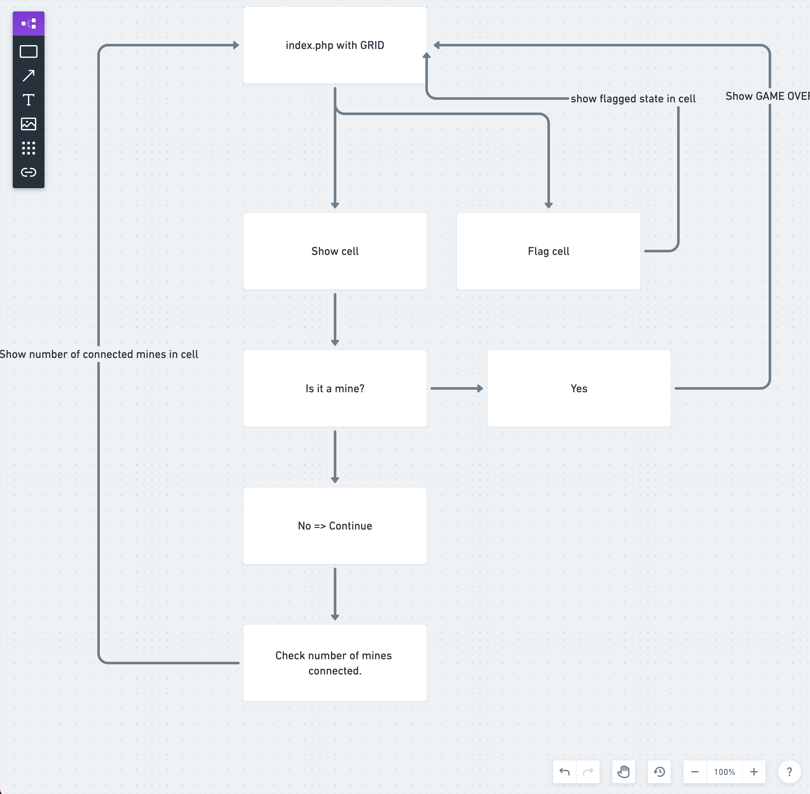

# PHP-Minesweeper

Minesweeper created with Basic PHP.

## Opdracht
We gaan voor deze opdracht het bekende spel 'Mijnenveger' nabouwen.

De logica van het spel is als volgt.

- Er is een grid met verschillende vakjes. Elk van deze vakjes kan een status hebben: CLEAR,FLAGGED,UNCOVERED & MINE
- 2 MIJNEN kunnen nooit vlak naast elkaar liggen.
- Het doel van het spel is om zo snel mogelijk alle vakjes op CLEAR te krijgen zonder een mijn te raken. Standaard zijn alle vakjes UNCOVERED.
- Je kan een vakje showen.  (Om de status UNCOVERED op te lossen)
    - Als dit een MIJN is, is het spel onmiddelijk gedaan (Je bent dood 😛 )
    - Als dit geen mijn is zal het vakje de status CLEAR krijgen en zal er getoond worden of er zich in de buurt mijnen bevinden. Bvb 1. Dan weet je dat er op één vakje zich een MIJN bevindt.
- Je kan een vakje ook FLAGGEN omdat je bvb denkt dat er zich hier een MIJN bevind.

### Flow Chart

### Screencast
https://grow.nxtmedia.technology/video/live-coding-minesweeper
